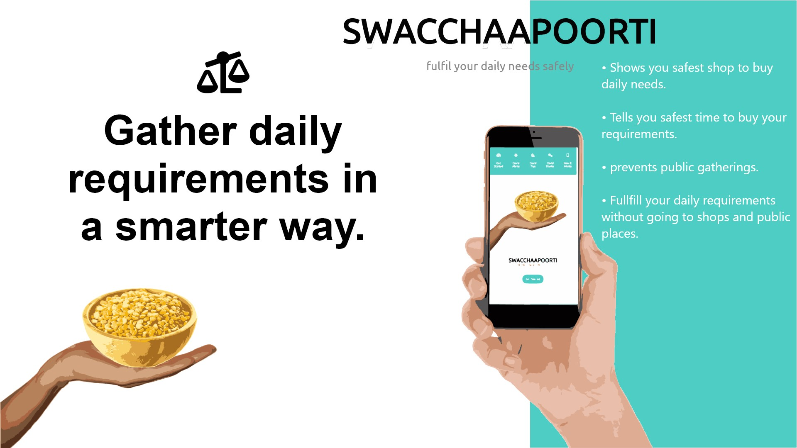
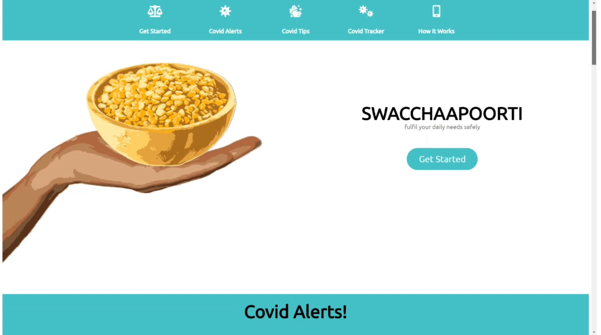
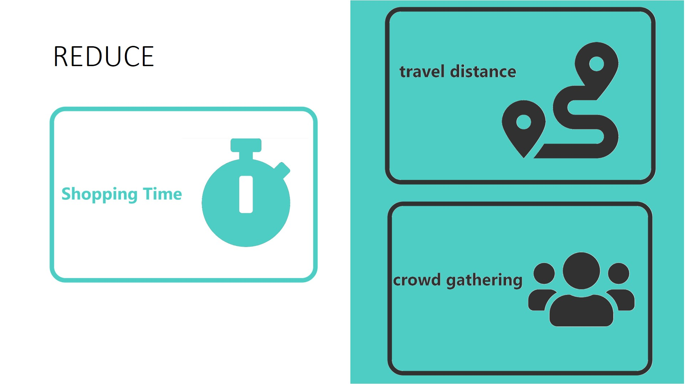
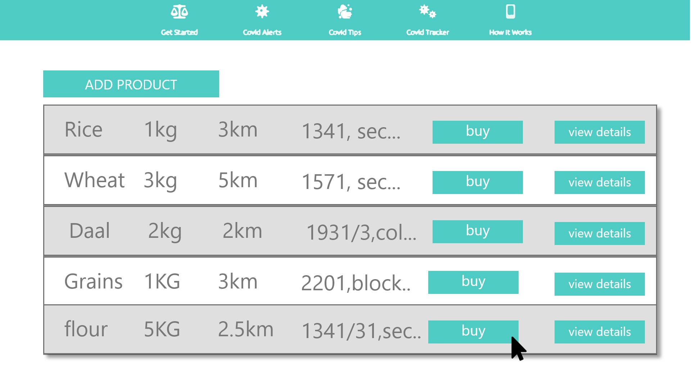
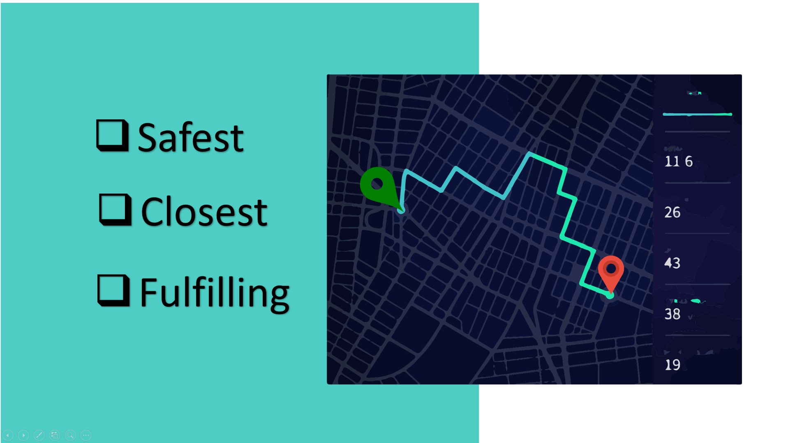
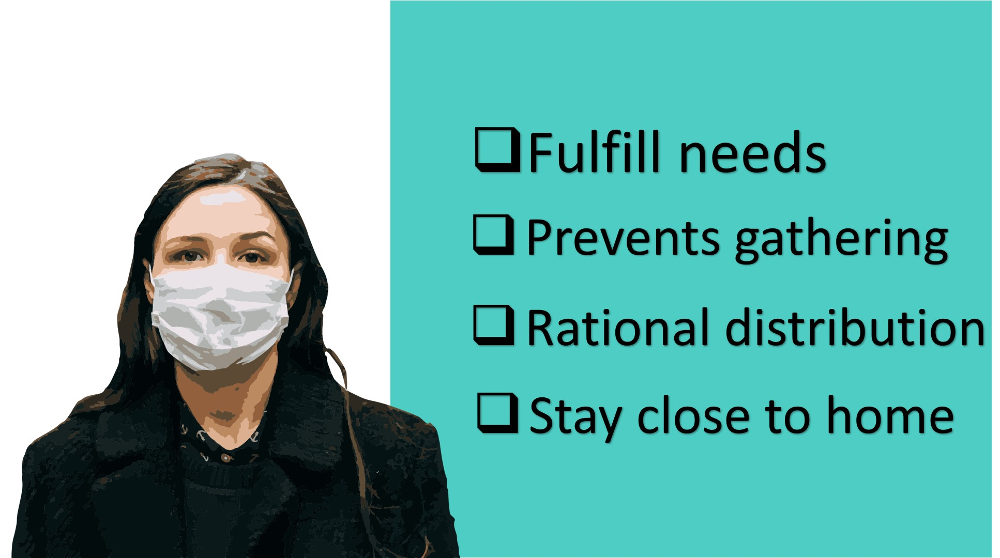

# Swacchaappoorti

## A project by Deepanshu Sharma

<b>As the whole world is passing through a pandemic, namely COVID 19. Implementation of internal lockdown and social distancing has been a game-changer in the containment process of the virus. Still, the exponential increase in the number of cases makes us re-think about the existence of a perfect lockdown.
As everything is not available easily,</b>

<b>fulfilling daily needs is a hardship for people.

Where people have many things in excess at their homes and don't need it. They need to move out to cater to something that they lack.

Even during shop visits, people tend to gather at a single shop among others without knowing the right and the safest place as per their requirements violating the rules of social distancing and creating a greater scope of spread of coronavirus.

Swacchaapoorti, an application designed to idealize the process of internal lockdown and social distancing.
It is a browser-based application that collects real-time data from users and shop owners.

Users can enter their requirements in our database. 

 
 
 
 
Our application will tell the user the safest, closest, and most fulfilling shop for their requirements.

 
It will also notify the users of the right time to buy their needs.

This will reduce the shopping time, travel distance, and crowd gathering at stores.

 
Besides this, the barter system feature in the application allows the user to enter the products they have in excess. Our application shows the user what nearby users have to offer in return.  

This will ease out the process of fulfilling each other's needs without gathering at stores, creating a rational distribution of products, and staying close to your home. 

 
 
 

<b>Eventually, preventing the substantial spreading of the virus.</b>
